# Polaris IDE

Polaris is a cutting-edge, browser-based Integrated Development Environment (IDE) built as a powerful alternative to traditional setups. It is deeply integrated with AI and modern web technologies, featuring real-time collaborative code editing, AI-powered code suggestions, in-browser code execution via WebContainers, and seamless GitHub integrations.

---

## 🎨 Frontend Experience

The frontend is engineered with Next.js 16, React 19, and Tailwind CSS 4, bringing a desktop-grade UI into the browser. We utilize CodeMirror 6 for robust text editing and shadcn/ui for stunning, accessible components.

### Landing Page & Onboarding
Begin your journey from our sleek landing page. You can kickstart a workspace by prompting the AI to generate a scaffold, or by directly importing an existing repository from GitHub.

**Landing Page**
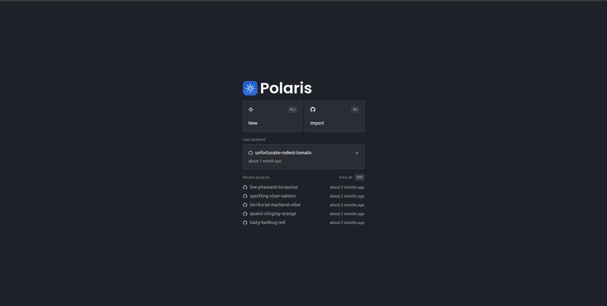

**Create Project with AI Prompt**
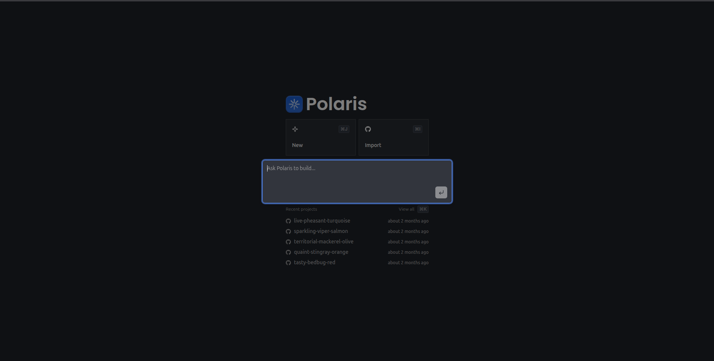

**Import Repository from GitHub**
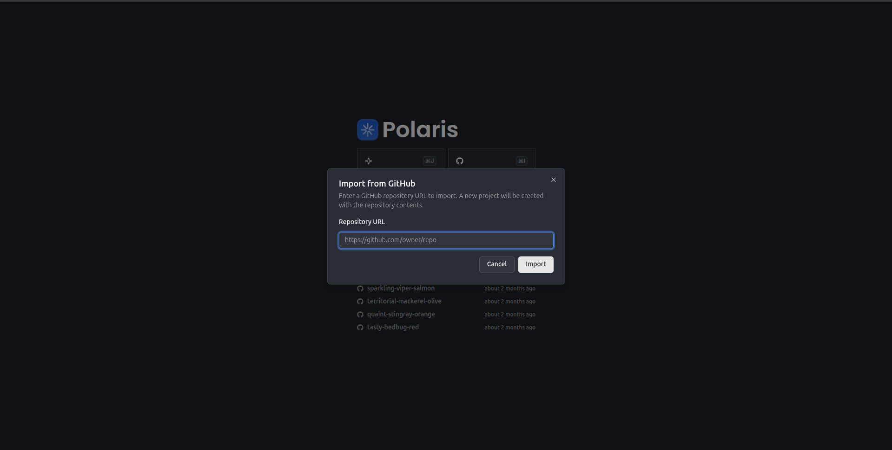

### The Workspace & Editor
The IDE comes packed with a customizable multi-pane layout. It includes a complete File Explorer, a CodeMirror-powered text editor with syntax highlighting, AI ghost-text suggestions, and a persistent conversational AI sidebar to help you write and refactor code.

**IDE Layout**
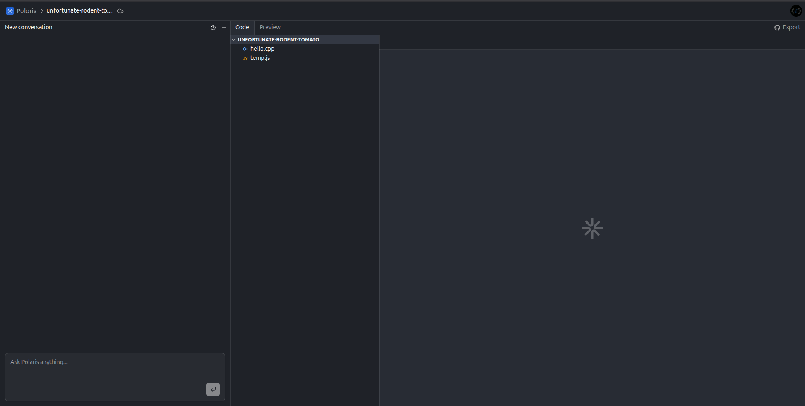

**Rich Text Editor**
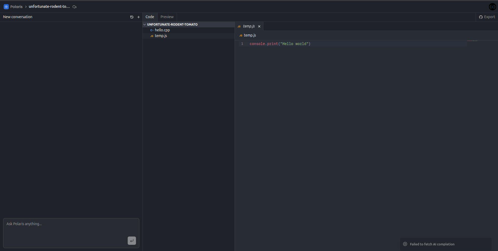

### Preview & GitHub Export
Run your code entirely in the browser using WebContainers without needing to spin up external VMs. Once you're done coding, you can securely export your new commits directly back to your GitHub repository.

**In-Browser Preview**
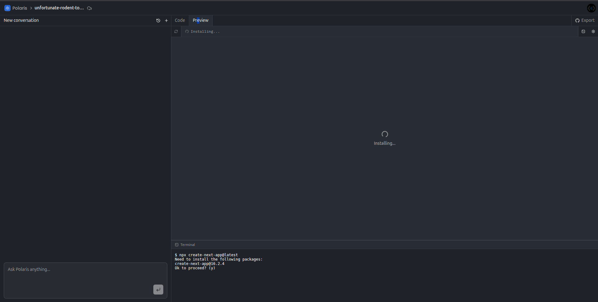

**GitHub Export**
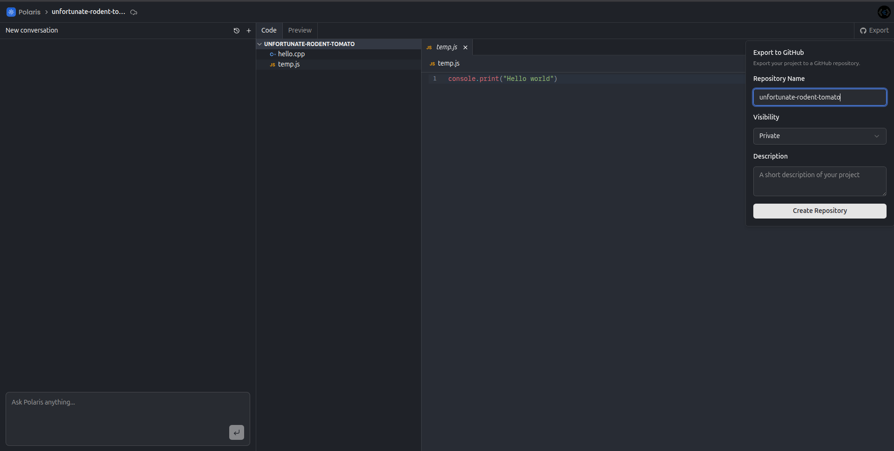

---

## ⚙️ Backend Architecture

Polaris utilizes a fully decoupled, serverless, and event-driven backend. Instead of relying on a traditional monolith, it harnesses **Convex** for real-time database syncing, **Inngest** for orchestrating long-running AI and GitHub tasks, and **Clerk** for robust authentication.

### High-Level Architecture
An overview of the complete Polaris infrastructure, illustrating the seamless communication between Next.js APIs, the Convex Data Layer, and Inngest background workers.

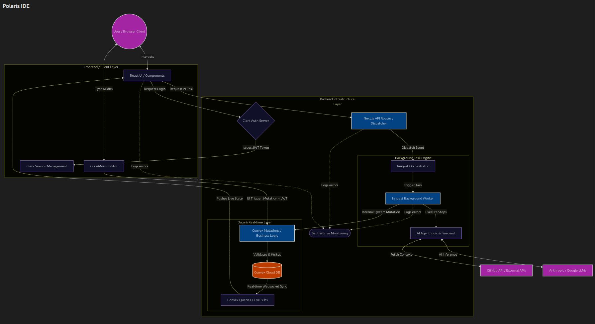

### Authentication Workflow
Authentication is managed via Clerk. It secures Next.js API routes natively and injects Row-Level Security directly into Convex by dynamically verifying JWTs on every database query and mutation.

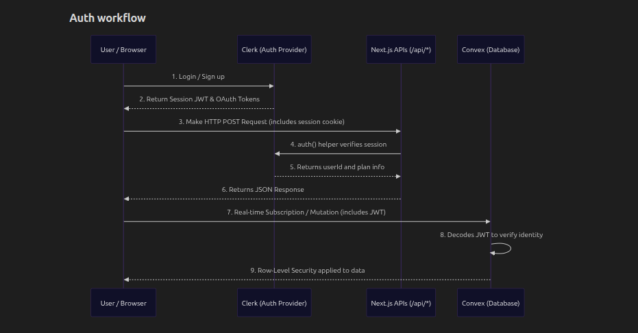

### Database Integration (Convex)
Our primary data layer is Convex, replacing traditional DBs, ORMs, and Websocket engines. It allows direct, authenticated real-time subscriptions for the frontend, and secure, system-level mutations for our background workers.

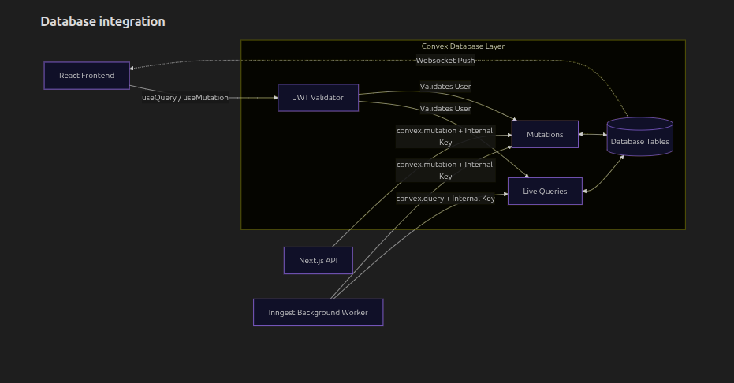

### API Workflow: AI Agent & Project Creation
AI generation is treated as a fully asynchronous task to avoid locking the UI. When a user requests a new project or sends a message, the Next.js API immediately responds to the frontend while triggering Inngest to handle Anthropic LLM streams. The background worker then commits the generated code securely back into Convex.

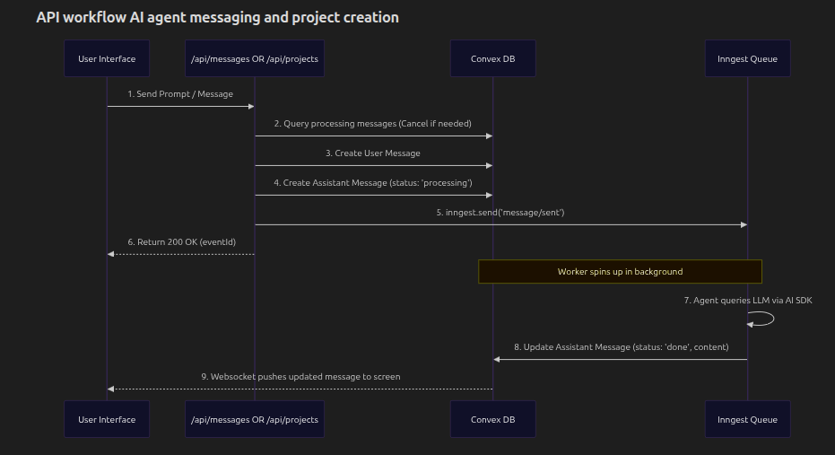

### GitHub Integration Workflow
Resource-intensive tasks, like cloning a repository or exporting commits, are strictly offloaded to Inngest background workers. This prevents Vercel edge-function timeouts and ensures reliable, stateful communication with the GitHub API using OAuth tokens managed securely by Clerk.

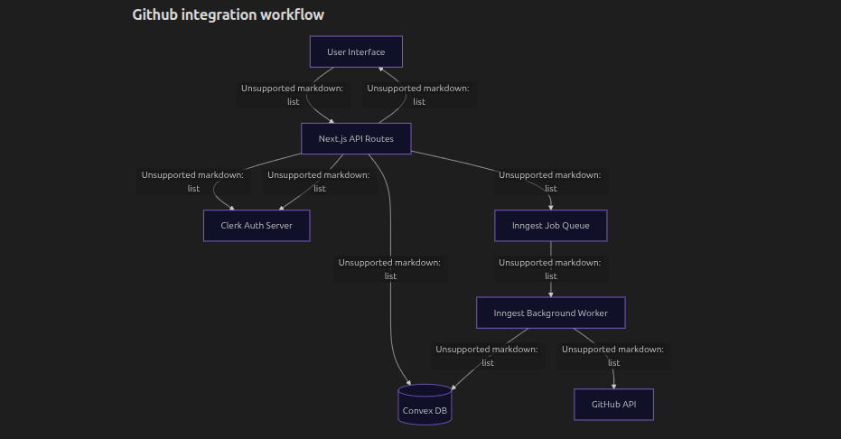
